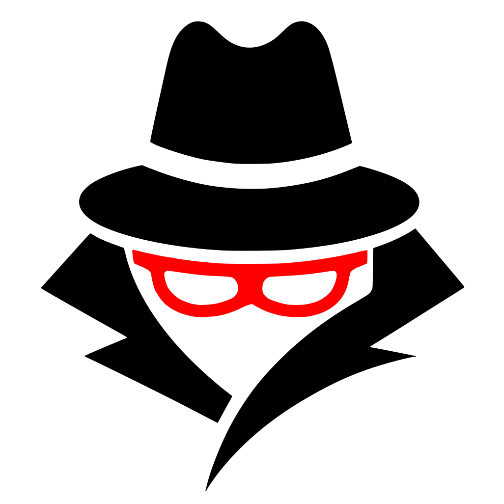

<div align="center">
  

  # 

  *A Drawing WebApp*

  <br>

  
  
  
  

  <br>

  > **Chromium-based browsers only.**
  > FreeHands was developed and tested exclusively on Chromium-based browsers (Chrome, Edge, Brave).
  > Firefox may exhibit visual inconsistencies in Canvas rendering, `globalCompositeOperation` compositing,
  > CSS filters, and custom scrollbars. A Chromium browser is strongly recommended.

  <br>

  ### [Try FreeHands Live](https://jm-works.github.io/FreeHands/)

</div>

---

## Features

<picture><source media="(prefers-color-scheme: dark)" srcset="src/assets/icons/Toolbar/dark/Brush.svg"></picture> **Drawing Tools** — Pressure-sensitive brush (`PressureBrush`) with real pointer pressure support, stabilized pencil (<picture><source media="(prefers-color-scheme: dark)" srcset="src/assets/icons/Toolbar/dark/Pen.svg"></picture>), and geometric eraser (<picture><source media="(prefers-color-scheme: dark)" srcset="src/assets/icons/Toolbar/dark/eraser.svg"></picture>) with boolean pixel destruction.

<picture><source media="(prefers-color-scheme: dark)" srcset="src/assets/icons/Toolbar/dark/Fill.svg"></picture> **Fill** — Flood Fill with configurable tolerance, operating directly on raw `ImageData` via BFS traversal.

<picture><source media="(prefers-color-scheme: dark)" srcset="src/assets/icons/Toolbar/dark/rectangle.svg"></picture> **Shapes & Text** — Rectangle, Ellipse (<picture><source media="(prefers-color-scheme: dark)" srcset="src/assets/icons/Toolbar/dark/ellipse.svg"></picture>), Line (<picture><source media="(prefers-color-scheme: dark)" srcset="src/assets/icons/Toolbar/dark/line.svg"></picture>), and a full `IText` editor (<picture><source media="(prefers-color-scheme: dark)" srcset="src/assets/icons/Toolbar/dark/text.svg"></picture>) with font, size, spacing, and style controls.

<picture><source media="(prefers-color-scheme: dark)" srcset="src/assets/icons/Toolbar/dark/select.svg"></picture> **Selection & Alignment** — Free-select with a floating `SelectionPanel` for align/distribute operations, magnetic snap guides via `AlignmentGuides` rendered on Fabric's `contextTop`.

<picture><source media="(prefers-color-scheme: dark)" srcset="src/assets/icons/Toolbar/dark/cutArea.svg"></picture> **Layers** — Dynamic layer stack with opacity, blend modes (`multiply`, `screen`, `overlay`, etc.), visibility, lock, drag-to-reorder, duplicate, merge-down, and delete.

<picture><source media="(prefers-color-scheme: dark)" srcset="src/assets/icons/Toolbar/dark/Pen.svg"></picture> **Undo / Redo** — Command Pattern history with atomic operations (`add`, `remove`, `modify`, `raster`, `layer`). Periodic snapshots every 15 commands for fast rewind.

<picture><source media="(prefers-color-scheme: dark)" srcset="src/assets/icons/Toolbar/dark/cutArea.svg"></picture> **Cut / Copy / Paste** — `CutAreaManager` for region-based selection and pixel extraction. Native Fabric clipboard for object-level copy/paste/duplicate (`Ctrl+C/V/X/D`).

<picture><source media="(prefers-color-scheme: dark)" srcset="src/assets/icons/Toolbar/dark/color_picker.svg"></picture> **Filters & Effects** — Per-selection Fabric.js image filters (brightness, contrast, blur, hue, sepia). Per-layer effects via `EffectManager` (shadow, noise, color overlay).

<picture><source media="(prefers-color-scheme: dark)" srcset="src/assets/icons/Toolbar/dark/hand.svg"></picture> **Canvas Textures** — Procedurally generated backgrounds (plain, parchment, kraft, grid) cached and applied silently without entering the undo history.

---

## How It Works

FreeHands uses a **Manager-based architecture** in Vanilla JS. Each subsystem is an encapsulated class that communicates via direct object references held by the central `CanvasManager`. No event bus, no framework reactivity.

The rendering pipeline overrides Fabric.js's internal `_renderObjects` to composite each layer onto an offscreen `layerCanvas` with its own `globalAlpha` and `globalCompositeOperation` before drawing to the main context. The brush engine combines the `perfect-freehand` library for stroke geometry with `fabric.Path` for vector storage, committing to the canvas and history only on `mouseup`.

See [`docs/ARCHITECTURE.md`](docs/ARCHITECTURE.md) for the full technical breakdown.

---

## Setup

```bash
git clone https://github.com/jm-works/FreeHands.git
cd FreeHands
# Open index.html in Chrome, Edge, or Brave
```

No `npm install`. No build step. Fabric.js is loaded via CDN.

---

## Project Docs

| Document | Description |
|---|---|
| [`docs/ARCHITECTURE.md`](docs/ARCHITECTURE.md) | System design, module graph, communication model |
| [`docs/MODULES.md`](docs/MODULES.md) | Per-module API and responsibilities |
| [`docs/HISTORY_SYSTEM.md`](docs/HISTORY_SYSTEM.md) | Command Pattern internals, op types, undo/redo flow |
| [`docs/CANVAS_RENDER.md`](docs/CANVAS_RENDER.md) | Layer compositing pipeline, offscreen rendering |
| [`docs/CONTRIBUTING.md`](docs/CONTRIBUTING.md) | Contribution guidelines and code conventions |

---

<sub>Parts of the codebase underwent AI-assisted technical review for bug identification and targeted corrections. Architecture, design, and implementation are original authorial work.</sub>