# FreeHands — Architecture

## Overview

FreeHands is a single-page drawing application with no build step, no framework, and no virtual DOM. The architecture is a flat graph of Manager classes that communicate via direct object references held by the central `CanvasManager`.

---

## Module Graph

```mermaid
graph TD
    APP[app.js] --> CM[CanvasManager]

    CM --> CR[CanvasRenderer]
    CM --> CE[CanvasEvents]
    CM --> CT[CanvasTools]
    CM --> CI[CanvasImage]
    CM --> CX[CanvasTexture]

    CM --> HM[HistoryManager]
    CM --> LM[LayerManager]
    CM --> FM[FillManager]
    CM --> CA[CutAreaManager]
    CM --> RM[RectangleManager]
    CM --> EM[EllipseManager]
    CM --> LN[LineManager]
    CM --> TM[TextManager]
    CM --> SP[SelectionPanel]
    CM --> AG[AlignmentGuides]
    CM --> CUR[CursorManager]
    CM --> EYE[EyeDropperManager]
    CM --> SH[ShortcutManager]

    APP --> COL[ColorManager]
    APP --> FIL[FilterManager]
    APP --> EFF[EffectManager]
    APP --> MENU[MenuManager]
```

---

## Communication Model

All managers receive a reference to `CanvasManager` at construction. Cross-module calls are direct method invocations — there is no event bus, no pub/sub, and no shared global state store.

This is intentional: the surface area is small, the call graph is traceable by reading the constructor arguments, and the absence of indirection makes bugs easier to locate.

`app.js` is the composition root. It constructs all top-level managers and wires UI controls to canvas methods. It is not a module — it is a wiring file.

---

## Key Architectural Decisions

**No UI framework.** All DOM elements are created imperatively via the DOM API (`document.createElement`, `classList`, `style`). Modals, sidebars, and panels are vanilla JS classes. This eliminates virtual DOM overhead and keeps the payload minimal.

**Fabric.js as geometry backend only.** FreeHands does not rely on Fabric's built-in brush system for the primary drawing tools. `PressureBrush` and `EraserBrush` extend `fabric.BaseBrush` but delegate stroke geometry to `perfect-freehand`, converting the output SVG path to a `fabric.Path` on commit.

**Rendering override.** `CanvasRenderer.overrideRender()` replaces Fabric's `_renderObjects` with a custom compositor that groups objects by `layerId` and composites each layer through an offscreen `layerCanvas`. This is required for per-layer `globalAlpha` and `globalCompositeOperation` to work correctly — Fabric has no native layer concept.

**History via atomic commands.** `HistoryManager` never snapshots the full canvas. Every undoable action produces a discrete op (`add`, `remove`, `modify`, `raster`, `layer`) that contains only the data needed to apply or reverse it. A periodic full snapshot is taken every 15 ops as a recovery baseline.

**Pixel operations outside Fabric.** `FillManager` and `EraserBrush` both rasterize to temporary offscreen `<canvas>` elements to read or write `ImageData` directly, bypassing Fabric's object model where pixel-level control is required.

---

## Canvas Element Structure

Fabric.js creates two stacked `<canvas>` elements inside a wrapper `
`:

- `lowerCanvasEl` — rendered scene (layers, objects). Target of `CanvasRenderer`.
- `upperCanvasEl` — interaction surface and `contextTop` (selection handles, guides, cursor previews).

`AlignmentGuides` draws onto `contextTop` during `after:render`, keeping guide lines in screen space without affecting the composited scene.

---

## State Ownership

| State | Owner |
|---|---|
| Layer stack (`layers[]`) | `LayerManager` |
| Active tool | `CanvasManager.currentTool` |
| Undo/redo op stack | `HistoryManager.ops[]` / `cursor` |
| Brush color, size, opacity | `CanvasManager` primitives |
| Clipboard | `CanvasManager._clipboard` |
| Texture cache | `CanvasTexture._cache` |

No state is stored in the DOM. DOM elements reflect state; they do not own it.
