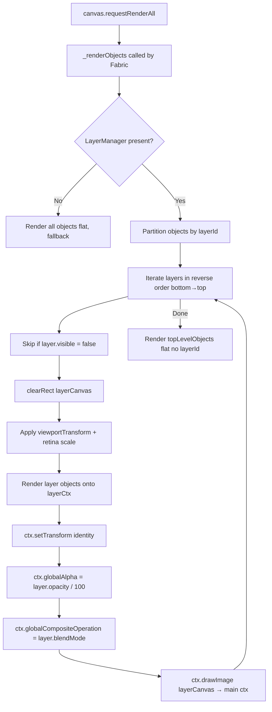

# FreeHands — Canvas Rendering Pipeline

## Why the Override Exists

Fabric.js renders all objects onto a single `CanvasRenderingContext2D` in a flat list. There is no native concept of layers with independent opacity or blend modes. Applying `globalAlpha` to the main context before drawing a subset of objects would contaminate objects rendered before and after.

The correct approach is to composite each layer onto an isolated offscreen surface at full opacity, then blend the result onto the main context as a single unit. `CanvasRenderer.overrideRender()` implements this.

---

## Compositing Pipeline



---

## Offscreen Surface

A single `layerCanvas` (`HTMLCanvasElement`, not attached to the DOM) is allocated once in `CanvasRenderer` constructor and reused across all render cycles. Its dimensions are synchronized to the lower canvas element's pixel dimensions (physical pixels, accounting for device pixel ratio) at the start of each render.

Reusing a single offscreen canvas rather than creating one per layer avoids repeated allocations in the render hot path.

---

## Viewport Transform

Fabric's `viewportTransform` is a 6-element affine matrix `[a, b, c, d, e, f]` representing the current pan and zoom state. This transform must be applied to `layerCtx` before rendering objects, and then the identity transform must be restored to `ctx` before compositing the layerCanvas — otherwise the composite `drawImage` call would be double-transformed.

```js
// Applied to layerCtx before rendering objects into the offscreen surface
this.layerCtx.transform(v[0], v[1], v[2], v[3], v[4], v[5]);

// Reset before compositing to main ctx
ctx.setTransform(1, 0, 0, 1, 0, 0);
ctx.globalAlpha = layer.opacity / 100;
ctx.globalCompositeOperation = layer.blendMode || 'source-over';
ctx.drawImage(this.layerCanvas, 0, 0);
```

---

## Eraser Compositing

`EraserBrush` and `CutAreaManager` use `destination-out` compositing to punch holes in existing pixels. This works correctly within the layer-isolated pipeline because:

1. The target object and the eraser shape are both rendered into a temporary `fabric.StaticCanvas` (via `rasterizeWithEraser`).
2. `destination-out` is applied there, in isolation.
3. The resulting cropped bitmap replaces the original object on the main canvas as a `fabric.Image`.

Applying `destination-out` directly on the main `lowerCanvasEl` would erase through all layers, not just the active one.

---

## contextTop and Overlay Drawing

`AlignmentGuides` and `SelectionPanel` interact with `canvas.contextTop` — the `CanvasRenderingContext2D` of Fabric's upper canvas element. This surface is separate from the composited scene and is cleared and redrawn by Fabric on every `requestRenderAll`. Guide lines and selection handles drawn here are automatically removed without needing explicit cleanup between frames.

---

## Browser Compatibility Note

The compositing pipeline relies on `globalCompositeOperation` behavior that is consistent across Chromium-based browsers. Firefox has known rendering differences in certain composite modes (particularly `destination-out` and `multiply` at low opacity). FreeHands is developed and tested on Chromium only; Firefox is not a supported target.
